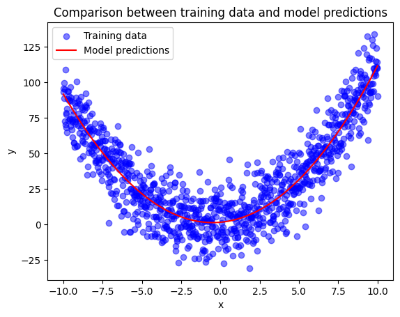
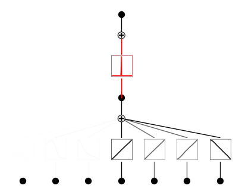

# Symbolic regression in KANs

This repository contains the results of the tests carried out to prove the ability of the Kolmogorov-Arnold neural
network to solve symbolic regression tasks.

## 📦 What does the repository offer?

### [Pendulum motion experiment](Pendulum_Motion.ipynb)

I recorded my smartphone's gyroscope and accelerometer sensors while it was swaying with a 50cm twine.

The goal is to make KAN retrieve the symbolic formula of the harmonic motion despite the sensor noise.

### [Comparison of different methods for Symbolic Regression](Comparison_of_different_methods_for_SR.ipynb)

The same symbolic regression task is solved using *Genetic Programming*, *Bayesian Method* and *KANs*. _(in progress)_.

### [Special function](Special_function.ipynb)

This test considers the sine integral special function:

$$Si(x) = \int_0^x \frac{\sin(t)}{t} dt$$

This function cannot be represented as a composition of common functions and is therefore a special function. Unlike
other symbolic regression algorithms, PyKAN is able to approximate it anyway, although the accuracy depends on the depth
of the architecture.

For reasons of interpretability, we train a rather small network, foregoing high accuracy.

Ground truth:

What the KAN learned:

$$2.5cos(1.5sin(0.17sin(-1.8x-6.2) \cdot (-1.8x-6.2)+3.9)-0.3)-1.4$$

### [Unsupervised learning](Unsupervised_Learning.ipynb)

In this test we try to solve an unsupervised learning problem. The data set consists of 7 variables with the following
relationships:

- $x_2=sin(6x_0)+e^{2x_1}$
- $x_6=4x_3+x_4+x_5$

KAN must discover these relationships based only on the value of these variables.

  
  

### [Plotting EfficientKAN activations](Plotting_Efficient_KAN.ipynb)

This notebook provides a basic implementation of the `.plot()` function for the EfficientKAN networks. This is useful
for interpretation purposes.

### [Reducing the lookup table size](Reducing_the_lookup_table_size.ipynb)

The goal of this experiment is to use KAN's regression capability to approximate the popular multivariate Newton's Law
of Gravity to a sum of univariate functions in order to reduce the size of the lookup table.

$$F(m_1,m_2,d)=G\cdot \frac{m1\cdot m2}{d^2}$$

  

After obtaining a reasonable training result, we show how the lookup table grows linearly with the number of samples of
the input variables. Considering that the classic lookup table grows $\mathcal{O}(N^d)$, this is a huge size reduction.

## 👨🏻‍💻 Authors

| Name              | Email                       | GitHub                                          |
|-------------------|-----------------------------|-------------------------------------------------|
| Valerio Morelli   | s1118781@studenti.univpm.it | [MrPio](https://github.com/MrPio)               |
| Federica Paganica | s1116749@studenti.univpm.it | [Federica](https://github.com/federicapaganica) |